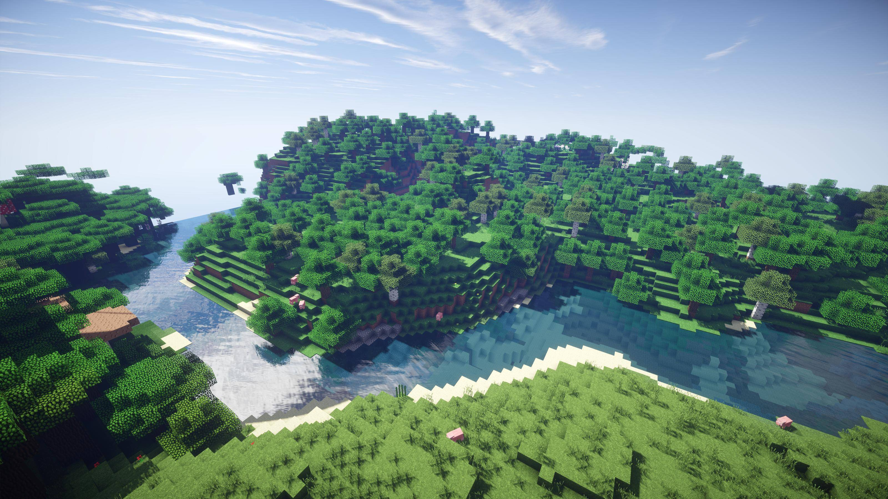
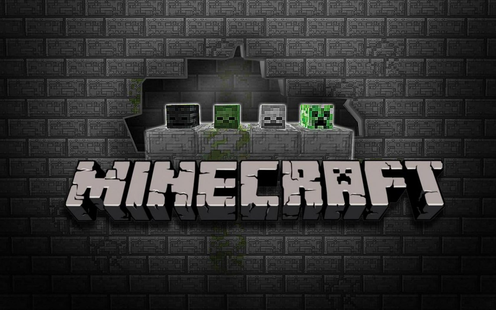

**Minecraft is a game that seemingly came out of nowhere and found unprecedented success. Made in May 2009 It was deceptively simple on its conception. This simplicity created the possibility for some of the most complex builds and contraptions ever created in game, in any game.** 

#### **The Theme**

People discovered a love of architecture they didn’t know existed, huge communities were built and are thriving all these years later and crazier than this, is the idea that many of this generation’s architects had their humble beginnings in Minecraft.

#### The Typography

The typography in Minecraft doesn’t deviate from the title’s iconic simplicity but moreover, compliments it by replicating it.
Minecraft uses a bitmap font; this means every character consists of small pixel like squares. This in turn gives a feeling of digitisation but oddly also gives a contrasting feeling retrograde. We rarely see pixels anymore with Retina Display and PixelSense and whilst they’re still there, our screen are now advanced that we don’t see them. Seeing them so blatantly in the font gives a feeling of reminiscence. There is no contrast in the font as every square that makes a character is of uniform proportions.

Each character except from uppercase “H”, “I”, “L” and “T” and lowercase “I” have squares missing in their shapes, creating white space albeit in the smallest amounts. When I look at this it evokes a feeling of partial completion as opposed to empty space per se. In any other title this could be deemed bas design, however in this regard its excellent design. When you look at the letters you want to build upon them, fill up the space by your own design which in essence is exactly the aim of this game. To build.

The title itself is extremely uniform in size, contrast, and weight. There are no serifs and the spacing between each character is precise. There are no lowercase letters. 

The design of the font has utilised the use of cracks, chips, and gouges in the characters, indicating a lack of structural integrity which we can assume is a nod to mineshaft element of the game and real-life dangers of frequenting such places. The letter “A” in the title is a mob in the game called a creeper. This adds to the feeling of danger associated with the mineshafts due to its explosive unpredictable nature, the cracks in the title would become full blown rubble if the creeper chose to go off. The characters in the title are made of tessellated blocks, we can tell this by looking at the upper inner edges of the “M”.

#### Conclusion And Verdict

For me this is an example of great design. Its simplicity fuels the possibility of what it could be trying to insinuate without pushing it into your face, it’s a game of interpretation which is surely the beginnings of any great work of art? 7.5/10