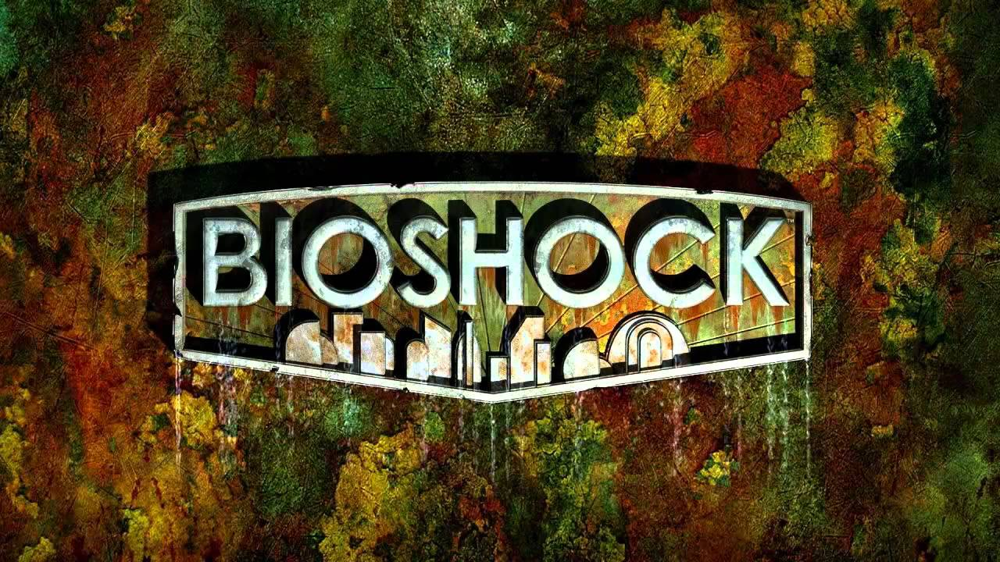

#### Bioshock

A game set in an alternate steampunk universe. Rapture is the setting for this game, An underwater city of wealth and luxurious debauchery. Rapture was the brainchild of a billionaire philanthropist and was curated as as a new home for the Uber riche who were bored with the tedious proceedings and overwhelming poverty on the surface and thus it was declared as a new utopia.

And then came the fall. 

The city wasn’t self sufficient, it relied heavily on a bio organic fuel called Adam (lol) the occupants of the city found out this could be used recreationally to enhance their genetic makeup and abilities. But they didn’t find out about the monstrous effects until they had descended into its clutches..

The typography and imagery within BioShock’s main title is blatantly angled towards something nautical. Water-stained metallic letters eroded by salt water deliver an impactful introduction. These are backed by a oxygen exposed and rusted copper background.  The font itself is reminiscent of a trade gothic type font. There are no serifs and no characterising features, the spacing is uniform with no deviation in kerning the letters are all following the same height line with no ascenders or descenders.

The true characteristics of this title come from the additional design styles. There is a 12’oclck shadow above the title this would represent a light source being shone from below. When you factor this in with ocean tainted state of everything else you can get an idea for the depth of the City of Rapture. 
The building shapes underneath “BioShock” are reminiscent of once towering city skyline, they now appear rusted, their shapes are foreign to our idea of building architecture today. This shows the separation from a terrestrial existence and their decent into a sub nautical one.

This is a title that is very suggestive in its foreshadowing. You can tell where the game is set and also the basic failure of whatever it once attempted to be. The font itself doesn’t give much away but the affects applied to it paint the story, in that way it’s quite like the game itself. You have no idea of what you’re descending into when you first arrive. But slowly, little things chip away at your sense of safety and with that your sense of reality and perception.