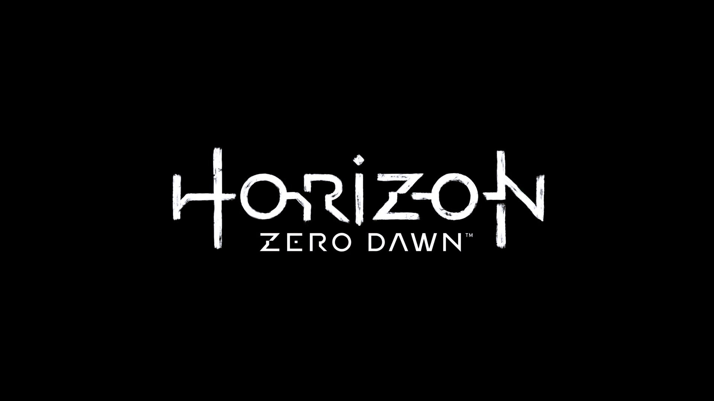

#### Horizon Zero Dawn

A game set in the future, based on an apocalyptic version of our world where nature has reclaimed what we stole from it. In a world where the relics of the ancient occupants have long since been buried, you need to use symbolism to navigate the world. This is an amazing title where symbolism is a huge indication of events past and events to come.

Horizon isn’t shy in revealing itself to the player. Long before you pick up a controller you know this game will be vast and technologically fuelled. The design of the title is amazingly done, depicted in a way that represents a fractured circuit, bits still clinging on just enough for you to be able to 
tell what it once was. 

The “H” represents an electric cell in a circuit diagram, whilst the “o” could be a reference for being switched on. The “R” represents wires crossing without a joining. The I when paired with the underline represents a wire joint in a circuit diagram. The “Z” is the variable resistance, and the “N” is a battery quite like the “H”. The outer diagonal slants of the “R” and “Z” form an almost perfect triangular shape, this is representative of the ARK, an in-game bastion that holds all fossilised technology. The colours used are white, giving off minimalism, simplicity, and purity. None are true except the last. This is a world in which technology is deemed impure and a world without it is untainted. Whilst the title is a circuit, it’s a fractured and broken one. The white colour in them smudged and fading in areas and chunks taken out of characters and stabbed into others like a chaotic experiment.

While non symmetrical, the design of the title uses a pseudo symmetry. This is done by using design styles as opposed to actual letters (except the “o”) to create the symmetry. The  word horizon is bordered by its own “H” and “N” which as aforementioned, represents the cells in a circuit. In this way the title is powered by its first and last letters. This could depict a necessary yet somewhat predictable journey, with the imagery of a circuit being used to represent the journey undertaken by the protagonist. The use of the “I” as a central place holder is because of “I” being associated with the information and technology age.

Describing this font with typography terms isn’t easy, though I’d say its novel, non-serifed, demi bold, with no contrasting. The spacing is uniform although the connectors to some of the characters could create the illusion of being closer.

This was one of the cleverer uses of design in game typography I’ve come across. It would be really interesting to have someone who hasn’t played the game describe what they get from the typography on the cover.