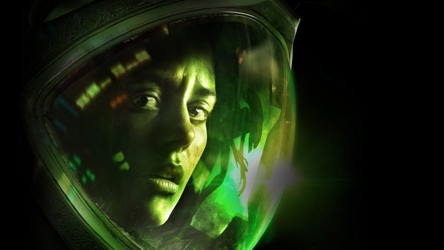

##### **Isolation, a term synonymous with separation and an independent existence. This game is the ultimate expression of human seclusion.**

#### The Theme

You are thrust into the interstellar expanse of space, aboard a ship dead in the water. Your team mysteriously disappear throughout a period of a few days and with nowhere to go apart from the unforgiving vacuum of space, it’s your job as the highest-ranking officer to find out where they are. The game is steeped in mystery with high tension moments made for you to straddle the edge of your seat, in tandem with an atmospheric and ominous vibe, this title speaks volumes.

#### The Typography

The typography makes excellent use of the concept of iconography. This is the idea of a sign or phrase being designed in a way that represents its meaning. Its an extremely clever manipulation of imagery. In this instance we see it used to press home the idea and feeling of isolation. The spacing between each character is massive, this is also representative of the huge expanse of space, moreover the locale of the game itself, a star system with no neighbouring planets or stars for lightyears. Moreover, with each character isolated from the next, it brings the title itself to life prior to even playing it.

Using an Arial font, the designer hasn’t tried to wow with slick contrasting or impressive descenders. There are no serifs self-proclaiming their importance here. Instead, the use of kerning and the white space created from it catches the eye. The cap height is also equal to the x height for this title. The word “isolation” has what appears to be system glitches behind the characters. This can be representative of the stranded element of the game with the computer systems being in disarray. 

The use of kerning here is notable, with the two characters from the word “isolation” being able to fit in the space between the individual characters of “Alien”. 

This gives the impression that while being alone is a big part of the game, an even bigger part would be the interaction with the antagonistic alien.
The themes from the back of the case follow a white, green, and black palette. Typical of the alien franchise, these colours represent the acidity of the alien scourge, the black expanse of space and utilises a white font for contrast.

#### Conclusion and Verdict

Alien Isolation utilises its typography in clever ways, they stay true to the themes of the game and mimic the franchises colour palette. Altogether a 7.5/10